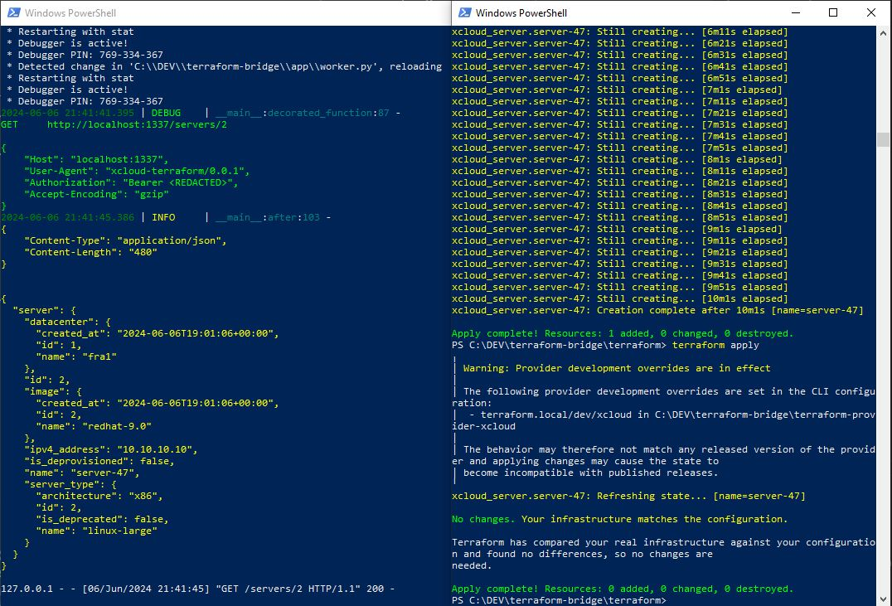

# TERRAFORM BRIDGE

This is a very simple example of a Terraform Bridge which you could use to create a Middleware between a Terraform Provider and your Infrastructure Orchestration Layer. This allows for the decoupling of maybe outdated interfaces and provides the simplicity and convenience of a Hyperscaler for your Platform Teams and gives your Site Reliability Engineers room to optimize the behind-the-scene systems. A simple and standardized REST API results in less work that needs to be done inside the Terraform Provider. A Terraform Provider is often just a REST Client disguised as a spaceship :P (Love you hashicorp :*)


Before first start:
```
cd app
python bootstrap.py

```

To start development server locally:

```
python app.py

```


To start worker locally:

```
python worker.py

```

Build the Terraform Provider once, then:

```
cd terraform
terraform apply

```


In a production environment you would of course use a reverse proxy in combination with gunicorn. Also something like supervisord to start the worker jobs or use something like celery if you want to go big :)


